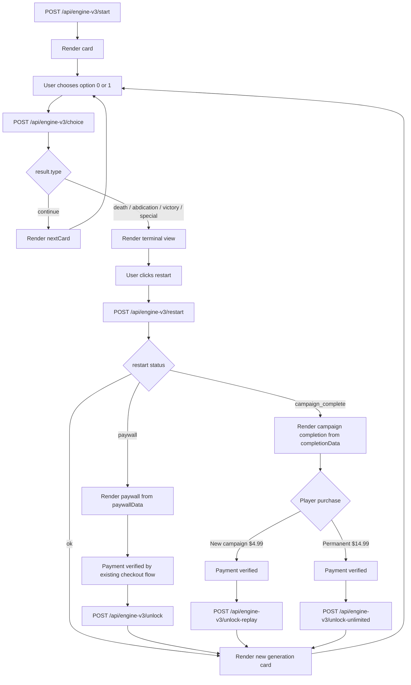

# Engine V3 UI Handoff

This document is the UI handoff contract for the P0 AI-native Reigns engine.

Scope:

- Engine and API only.
- No UI component code.
- API is stateless for P0: the frontend sends `GameState` back to the API.
- Rules own numeric state changes. LLM rendering may rewrite presentation text only.

## 1. Type Definitions

Source files:

- `src/lib/engine-v3/event.schema.ts`
- `src/lib/engine-v3/state.ts`
- `src/lib/engine-v3/select-event.ts`
- `src/lib/engine-v3/scripted.ts`
- `src/lib/engine-v3/telemetry.ts`

### 1.1 Core Engine Types

```ts
export type EraId = "queen" | "napoleon";

export type LlmRenderMode = "none" | "flavor" | "climax";

export type EventTag =
  | "governance"
  | "court"
  | "military"
  | "treasury"
  | "people"
  | "diplomacy"
  | "religion"
  | "betrayal"
  | "crisis"
  | "npc"
  | "death"
  | "legacy"
  | "rare";

export type StateTrackId =
  | "nobility"
  | "people"
  | "army"
  | "treasury"
  | "diplomacy"
  | "publicSupport";

export interface StateCondition {
  track: StateTrackId;
  operator: "<" | "<=" | ">" | ">=" | "==" | "!=";
  value: number;
}

export interface EventTrigger {
  minRound?: number;
  maxRound?: number;
  any?: StateCondition[];
  all?: StateCondition[];
  none?: StateCondition[];
  requiredFlags?: string[];
  blockedFlags?: string[];
}

export interface EventRequirements {
  events?: string[];
  flags?: string[];
  legacies?: string[];
}

export interface EventExcludes {
  events?: string[];
  flags?: string[];
  legacies?: string[];
}

export interface EventCooldown {
  event: number;
  tags?: Partial<Record<EventTag, number>>;
}

export interface EventChoice {
  id: string;
  labelTemplate: string;
  intent: string;
  previewTracks: StateTrackId[];
}

export interface ChoiceEffect {
  delta: Partial<Record<StateTrackId, number>>;
  addFlags?: string[];
  removeFlags?: string[];
  addLegacy?: LegacySeed;
  keyChoice?: boolean;
  forceOutcome?: TerminalOutcomeSeed;
}

export type ChoiceEffectsById = Record<string, ChoiceEffect>;

export interface EventTemplate {
  title: string;
  body: string;
  npcName?: string;
  npcLine?: string;
}

export interface EngineEvent {
  id: string;
  era: EraId;
  tags: EventTag[];
  trigger: EventTrigger;
  choices: EventChoice[];
  effects: ChoiceEffectsById;
  requires: EventRequirements;
  excludes: EventExcludes;
  cooldown: EventCooldown;
  llmRenderMode: LlmRenderMode;
  weight?: number;
  template: EventTemplate;
}

export interface LegacySeed {
  id: string;
  label: string;
  description: string;
  statBias?: Partial<Record<StateTrackId, number>>;
  expiresAfterGenerations?: number;
}

export interface TerminalOutcomeSeed {
  type: "death" | "abdication" | "victory" | "special";
  id: string;
}

export interface EventPoolFile {
  schemaVersion: 3;
  events: EngineEvent[];
}

export type GamePhase = "active" | "terminal" | "campaign_complete";

export type GameMode = "scripted" | "freeplay";

export interface GameState {
  runId: string;
  era: EraId;
  rulerName: string;
  generation: number;
  phase: GamePhase;
  round: number;
  year: number;
  startedAt: string;
  updatedAt: string;
  mode: GameMode;
  fatesDiscovered: string[];
  isPaid: boolean;
  campaignNumber: number;
  campaignStartGen: number;
  isUnlimitedPaid: boolean;
  bars: Partial<Record<StateTrackId, number>>;
  highestBars: Partial<Record<StateTrackId, number>>;
  lowestBars: Partial<Record<StateTrackId, number>>;
  occurredEventIds: string[];
  lastEventId?: string;
  lastEventTags: EventTag[];
  cooldowns: CooldownState;
  flags: string[];
  inheritedLegacies: Legacy[];
  pendingLegacies: Legacy[];
  dynastyRecords: DynastyRecord[];
  keyChoices: KeyChoiceRecord[];
  llmCallsThisRun: number;
}

export interface CooldownState {
  events: Record<string, number>;
  tags: Partial<Record<EventTag, number>>;
}

export interface Legacy extends LegacySeed {
  gainedAtGeneration: number;
  remainingGenerations?: number;
}

export interface KeyChoiceRecord {
  round: number;
  eventId: string;
  choiceId: string;
  choiceLabel: string;
  summary: string;
  barsAfter: Partial<Record<StateTrackId, number>>;
}

export interface DynastyRecord {
  id: string;
  generation: number;
  rulerName: string;
  era: EraId;
  startYear: number;
  endYear: number;
  rulingYears: number;
  terminalType: TerminalType;
  terminalId: string;
  death?: DeathRecord;
  highestBars: Partial<Record<StateTrackId, number>>;
  lowestBars: Partial<Record<StateTrackId, number>>;
  keyChoices: KeyChoiceRecord[];
  inheritedLegacies: Legacy[];
  gainedLegacies: Legacy[];
  createdAt: string;
}

export type TerminalType = "continue" | "death" | "abdication" | "victory" | "special";

export type DeathId =
  | "queen_noble_revolt"
  | "queen_aristocratic_coup"
  | "queen_popular_uprising"
  | "queen_mob_rule"
  | "queen_foreign_occupation"
  | "queen_military_regency"
  | "queen_bankruptcy"
  | "queen_merchant_oligarchy"
  | "napoleon_army_mutiny"
  | "napoleon_marshal_coup"
  | "napoleon_state_bankruptcy"
  | "napoleon_profiteer_capture"
  | "napoleon_coalition_invasion"
  | "napoleon_puppet_emperor"
  | "napoleon_public_abdication"
  | "napoleon_populist_cult"
  | "scripted_death";

export interface DeathRecord {
  id: DeathId;
  label: string;
  causeTrack?: StateTrackId;
  direction?: "too_low" | "too_high" | "forced";
  round: number;
  year: number;
  epitaphTemplate: string;
}

export interface StateTrackConfig {
  id: StateTrackId;
  label: string;
  initial: number;
  min: number;
  max: number;
  lowDeathAt: number;
  highDeathAt: number;
  lowDeathId: DeathId;
  highDeathId: DeathId;
}

export interface EraStateConfig {
  era: EraId;
  startYear: number;
  targetRoundsForVictory: number;
  tracks: StateTrackConfig[];
}

export type GameResultType = TerminalType;

export interface GameResult {
  type: GameResultType;
  terminalId?: string;
  death?: DeathRecord;
  dynastyRecord?: DynastyRecord;
  nextGenerationState?: GameState;
}

export interface ApplyChoiceResult {
  gameState: GameState;
  result: GameResult;
}

export interface ScriptedEvent {
  eventId: string;
  overrideEffects?: Partial<ChoiceEffectsById>;
}

export interface ScriptedReign {
  generation: 1 | 2;
  events: ScriptedEvent[];
  forcedDeathAfter?: number;
}

export interface RestartPaywallData {
  dynastyRecords: DynastyRecord[];
  fatesDiscovered: string[];
  nextGeneration: number;
}

export interface CampaignCompletionData {
  dynastyRecords: DynastyRecord[];
  fatesDiscovered: string[];
  totalGenerations: number;
  longestReign: {
    rulerName: string;
    years: number;
  };
  shortestReign: {
    rulerName: string;
    years: number;
  };
  campaignNumber: number;
}

export interface RestartResponse {
  status: "ok" | "paywall" | "campaign_complete";
  paywallData?: RestartPaywallData;
  completionData?: CampaignCompletionData;
  gameState?: GameState;
  card?: RenderedCard;
}

export interface UnlockResponse {
  status: "ok";
  gameState: GameState;
  card: RenderedCard;
}

export interface RenderedCard {
  eventId: string;
  mode: LlmRenderMode;
  title: string;
  body: string;
  choices: RenderedChoice[];
  npc?: {
    name: string;
    line: string;
  };
  statePreview: StateTrackId[];
  llmUsed: boolean;
  llmProvider?: "deepseek" | "anthropic";
  fallbackReason?: "budget_exhausted" | "provider_not_configured" | "llm_error" | "invalid_llm_output";
}

export interface RenderedChoice {
  id: string;
  label: string;
  intent: string;
  previewTracks: StateTrackId[];
}

export type LlmProviderName = "deepseek" | "anthropic";

export interface RenderEventOptions {
  provider?: "template" | LlmProviderName | LlmRenderProvider;
  maxLlmCallsPerRun?: number;
}

export interface LlmRenderProvider {
  name: LlmProviderName;
  renderFlavor?: (input: FlavorPromptInput) => Promise<FlavorPromptOutput>;
  renderClimax?: (input: ClimaxPromptInput) => Promise<FlavorPromptOutput>;
}

interface BasePromptInput<TTask extends "render_event_flavor" | "render_event_climax"> {
  task: TTask;
  constraints: {
    language: "en";
    maxBodyWords: number;
    preserveChoiceCount: 2;
    doNotChangeRules: true;
    noSpoilers: true;
  };
  event: {
    id: string;
    title: string;
    body: string;
    npcName?: string;
    npcLine?: string;
    choices: { id: string; label: string; intent: string }[];
  };
  state: {
    era: EraId;
    rulerName: string;
    generation: number;
    year: number;
    bars: Partial<Record<StateTrackId, number>>;
    inheritedLegacies: string[];
  };
}

export type FlavorPromptInput = BasePromptInput<"render_event_flavor">;

export interface ClimaxPromptInput
  extends Omit<BasePromptInput<"render_event_climax">, "constraints"> {
  constraints: FlavorPromptInput["constraints"] & {
    maxBodyWords: 130;
    makeItShareable: true;
  };
  historySummary: {
    lastKeyChoices: {
      round: number;
      eventId: string;
      choiceLabel: string;
      summary: string;
    }[];
    dynastyRecords: {
      generation: number;
      terminalId: string;
      rulingYears: number;
    }[];
    strongestLegacy?: string;
    weakestTrack?: StateTrackId;
    strongestTrack?: StateTrackId;
  };
}

export interface FlavorPromptOutput {
  title: string;
  body: string;
  npc?: {
    name: string;
    line: string;
  };
  choices: { id: string; label: string }[];
}

export type EngineTelemetryEventName =
  | "engine_v3_first_run_started"
  | "engine_v3_run_started"
  | "engine_v3_card_viewed"
  | "engine_v3_choice_submitted"
  | "engine_v3_terminal_reached"
  | "engine_v3_death_reached"
  | "engine_v3_victory_reached"
  | "engine_v3_restart_clicked"
  | "engine_v3_next_generation_started"
  | "engine_v3_run_completed"
  | "engine_v3_share_clicked"
  | "engine_v3_llm_rendered"
  | "engine_v3_llm_fallback";

export interface EngineTelemetryPayload {
  runId: string;
  era: EraId;
  generation: number;
  round: number;
  eventId?: string;
  choiceId?: string;
  eventTags?: EventTag[];
  terminalType?: TerminalType;
  terminalId?: string;
  deathId?: DeathId;
  decisionCount?: number;
  runDurationMs?: number;
  llmCallsThisRun?: number;
  llmProvider?: LlmProviderName;
  llmMode?: LlmRenderMode;
  shareSurface?: "ending_card" | "death_record" | "dynasty_archive";
  bars?: Partial<Record<StateTrackId, number>>;
}

export interface EngineTelemetryEvent {
  name: EngineTelemetryEventName;
  payload: EngineTelemetryPayload;
}

export interface ValidationResult {
  ok: boolean;
  errors: string[];
}
```

### 1.2 State Bar Configs

```ts
export const QUEEN_STATE_CONFIG: EraStateConfig = {
  era: "queen",
  startYear: 1560,
  targetRoundsForVictory: 30,
  tracks: [
    {
      id: "nobility",
      label: "Nobility",
      initial: 50,
      min: 0,
      max: 100,
      lowDeathAt: 0,
      highDeathAt: 100,
      lowDeathId: "queen_noble_revolt",
      highDeathId: "queen_aristocratic_coup",
    },
    {
      id: "people",
      label: "People",
      initial: 50,
      min: 0,
      max: 100,
      lowDeathAt: 0,
      highDeathAt: 100,
      lowDeathId: "queen_popular_uprising",
      highDeathId: "queen_mob_rule",
    },
    {
      id: "army",
      label: "Army",
      initial: 50,
      min: 0,
      max: 100,
      lowDeathAt: 0,
      highDeathAt: 100,
      lowDeathId: "queen_foreign_occupation",
      highDeathId: "queen_military_regency",
    },
    {
      id: "treasury",
      label: "Treasury",
      initial: 50,
      min: 0,
      max: 100,
      lowDeathAt: 0,
      highDeathAt: 100,
      lowDeathId: "queen_bankruptcy",
      highDeathId: "queen_merchant_oligarchy",
    },
  ],
};

export const NAPOLEON_STATE_CONFIG: EraStateConfig = {
  era: "napoleon",
  startYear: 1796,
  targetRoundsForVictory: 30,
  tracks: [
    {
      id: "army",
      label: "Army",
      initial: 55,
      min: 0,
      max: 100,
      lowDeathAt: 0,
      highDeathAt: 100,
      lowDeathId: "napoleon_army_mutiny",
      highDeathId: "napoleon_marshal_coup",
    },
    {
      id: "treasury",
      label: "Treasury",
      initial: 45,
      min: 0,
      max: 100,
      lowDeathAt: 0,
      highDeathAt: 100,
      lowDeathId: "napoleon_state_bankruptcy",
      highDeathId: "napoleon_profiteer_capture",
    },
    {
      id: "diplomacy",
      label: "Diplomacy",
      initial: 45,
      min: 0,
      max: 100,
      lowDeathAt: 0,
      highDeathAt: 100,
      lowDeathId: "napoleon_coalition_invasion",
      highDeathId: "napoleon_puppet_emperor",
    },
    {
      id: "publicSupport",
      label: "Public Support",
      initial: 50,
      min: 0,
      max: 100,
      lowDeathAt: 0,
      highDeathAt: 100,
      lowDeathId: "napoleon_public_abdication",
      highDeathId: "napoleon_populist_cult",
    },
  ],
};
```

### 1.3 Additional Exported API/Utility Contracts

```ts
export interface CreateInitialGameStateInput {
  era: EraId;
  rulerName: string;
  runId?: string;
  now?: Date;
  inheritedLegacies?: Legacy[];
  llmCallsThisRun?: number;
  mode?: GameMode;
  fatesDiscovered?: string[];
  isPaid?: boolean;
  campaignNumber?: number;
  campaignStartGen?: number;
  isUnlimitedPaid?: boolean;
}

export interface SelectEventOptions {
  pool?: EngineEvent[];
  rng?: () => number;
}

export interface EngineTelemetrySink {
  record: (event: EngineTelemetryEvent) => Promise<void> | void;
}

export interface RecordTelemetryOptions {
  sink?: EngineTelemetrySink;
}

export interface MemoryTelemetrySink extends EngineTelemetrySink {
  events: EngineTelemetryEvent[];
}
```

## 2. API Routes

### 2.1 `POST /api/engine-v3/start`

Purpose: create an initial `GameState`, select the first event, and return the first `RenderedCard`.

Method: `POST`

Request body type:

```ts
export interface StartGameRequest {
  era: EraId;
  rulerName: string;
  runId?: string;
}
```

Response body type:

```ts
export interface StartGameResponse {
  gameState: GameState;
  card: RenderedCard;
}
```

Actual request JSON example:

```json
{
  "era": "queen",
  "rulerName": "Isolde",
  "runId": "run-queen-demo-001"
}
```

Actual response JSON example:

```json
{
  "gameState": {
    "runId": "run-queen-demo-001",
    "era": "queen",
    "rulerName": "Isolde",
    "generation": 1,
    "phase": "active",
    "round": 0,
    "year": 1560,
    "startedAt": "2026-06-26T00:00:00.000Z",
    "updatedAt": "2026-06-26T00:00:00.000Z",
    "mode": "scripted",
    "fatesDiscovered": [],
    "isPaid": false,
    "campaignNumber": 1,
    "campaignStartGen": 1,
    "isUnlimitedPaid": false,
    "bars": {
      "nobility": 50,
      "people": 50,
      "army": 50,
      "treasury": 50
    },
    "highestBars": {
      "nobility": 50,
      "people": 50,
      "army": 50,
      "treasury": 50
    },
    "lowestBars": {
      "nobility": 50,
      "people": 50,
      "army": 50,
      "treasury": 50
    },
    "occurredEventIds": [],
    "lastEventTags": [],
    "cooldowns": {
      "events": {},
      "tags": {}
    },
    "flags": [],
    "inheritedLegacies": [],
    "pendingLegacies": [],
    "dynastyRecords": [
      {
        "id": "dynasty-gen-10",
        "generation": 10,
        "rulerName": "Isolde",
        "era": "queen",
        "startYear": 1605,
        "endYear": 1610,
        "rulingYears": 5,
        "terminalType": "death",
        "terminalId": "queen_military_regency",
        "death": {
          "id": "queen_military_regency",
          "label": "Military Regency",
          "causeTrack": "army",
          "direction": "too_high",
          "round": 5,
          "year": 1610,
          "epitaphTemplate": "{{rulerName}} vanished into a disputed chronicle."
        },
        "highestBars": { "nobility": 70, "people": 68, "army": 100, "treasury": 62 },
        "lowestBars": { "nobility": 38, "people": 41, "army": 42, "treasury": 32 },
        "keyChoices": [],
        "inheritedLegacies": [],
        "gainedLegacies": [],
        "createdAt": "2026-06-26T00:04:45.000Z"
      }
    ],
    "keyChoices": [],
    "llmCallsThisRun": 0
  },
  "card": {
    "eventId": "queen_scripted_g1_oath_001",
    "mode": "none",
    "title": "The First Oath",
    "body": "Isolde, the great hall lowers itself into silence. The nobles wait to learn whether your first command will sound merciful or absolute.",
    "choices": [
      {
        "id": "left",
        "label": "Pardon the late swearers",
        "intent": "Begin with mercy",
        "previewTracks": ["people", "nobility"]
      },
      {
        "id": "right",
        "label": "Fine every late oath",
        "intent": "Begin with discipline",
        "previewTracks": ["treasury", "nobility"]
      }
    ],
    "npc": {
      "name": "Lord Chancellor",
      "line": "Your Majesty, one word from you will teach the court how close to kneel."
    },
    "statePreview": ["people", "nobility", "treasury"],
    "llmUsed": false
  }
}
```

Notes:

- The route currently uses server time for `startedAt` and `updatedAt`. The fixed timestamp above is a concrete example.
- If `runId` is omitted, the engine generates one.
- Unpaid starts default to `mode: "scripted"`, `isPaid: false`, and the fixed Generation I script.
- Invalid payload returns HTTP `400` with `{ "error": "Invalid engine-v3 start payload" }`.

### 2.2 `POST /api/engine-v3/choice`

Purpose: apply one binary choice against the current `GameState` and `EngineEvent`. Returns either a continuing state plus `nextCard`, or a terminal result without `nextCard`.

Method: `POST`

Request body type:

```ts
export interface SubmitChoiceRequest {
  runId: string;
  gameState: GameState;
  eventId: string;
  choiceIndex: number;
}
```

Response body type:

```ts
export interface SubmitChoiceResponse {
  gameState: GameState;
  result: GameResult;
  nextCard?: RenderedCard;
}
```

Actual request JSON example:

```json
{
  "runId": "run-queen-demo-001",
  "eventId": "queen_scripted_g1_oath_001",
  "choiceIndex": 0,
  "gameState": {
    "runId": "run-queen-demo-001",
    "era": "queen",
    "rulerName": "Isolde",
    "generation": 1,
    "phase": "active",
    "round": 0,
    "year": 1560,
    "startedAt": "2026-06-26T00:00:00.000Z",
    "updatedAt": "2026-06-26T00:00:00.000Z",
    "mode": "scripted",
    "fatesDiscovered": [],
    "isPaid": false,
    "bars": {
      "nobility": 50,
      "people": 50,
      "army": 50,
      "treasury": 50
    },
    "highestBars": {
      "nobility": 50,
      "people": 50,
      "army": 50,
      "treasury": 50
    },
    "lowestBars": {
      "nobility": 50,
      "people": 50,
      "army": 50,
      "treasury": 50
    },
    "occurredEventIds": [],
    "lastEventTags": [],
    "cooldowns": {
      "events": {},
      "tags": {}
    },
    "flags": [],
    "inheritedLegacies": [],
    "pendingLegacies": [],
    "dynastyRecords": [],
    "keyChoices": [],
    "llmCallsThisRun": 0
  }
}
```

Actual response JSON example, continuing run:

```json
{
  "gameState": {
    "runId": "run-queen-demo-001",
    "era": "queen",
    "rulerName": "Isolde",
    "generation": 1,
    "phase": "active",
    "round": 1,
    "year": 1561,
    "startedAt": "2026-06-26T00:00:00.000Z",
    "updatedAt": "2026-06-26T00:00:01.000Z",
    "mode": "scripted",
    "fatesDiscovered": [],
    "isPaid": false,
    "bars": {
      "nobility": 47,
      "people": 56,
      "army": 50,
      "treasury": 50
    },
    "highestBars": {
      "nobility": 50,
      "people": 56,
      "army": 50,
      "treasury": 50
    },
    "lowestBars": {
      "nobility": 47,
      "people": 50,
      "army": 50,
      "treasury": 50
    },
    "occurredEventIds": ["queen_scripted_g1_oath_001"],
    "lastEventId": "queen_scripted_g1_oath_001",
    "lastEventTags": ["court", "governance"],
    "cooldowns": {
      "events": {
        "queen_scripted_g1_oath_001": 999
      },
      "tags": {}
    },
    "flags": [],
    "inheritedLegacies": [],
    "pendingLegacies": [],
    "dynastyRecords": [],
    "keyChoices": [],
    "llmCallsThisRun": 0
  },
  "result": {
    "type": "continue"
  },
  "nextCard": {
    "eventId": "queen_scripted_g1_silk_tribute_002",
    "mode": "flavor",
    "title": "Silk at the Gate",
    "body": "A caravan master offers a chest of silk if the crown closes the northern tolls to his rivals.",
    "choices": [
      {
        "id": "left",
        "label": "Grant the monopoly",
        "intent": "Take the easy gold",
        "previewTracks": ["treasury", "people"]
      },
      {
        "id": "right",
        "label": "Keep the roads open",
        "intent": "Protect the markets",
        "previewTracks": ["treasury", "people"]
      }
    ],
    "npc": {
      "name": "Master Vey",
      "line": "Your Majesty, I beg only for a small monopoly. In return, your vault will hear music."
    },
    "statePreview": ["treasury", "people"],
    "llmUsed": false
  }
}
```

Actual response JSON example, terminal death:

```json
{
  "gameState": {
    "runId": "run-queen-terminal-001",
    "era": "queen",
    "rulerName": "Isolde",
    "generation": 1,
    "phase": "terminal",
    "round": 6,
    "year": 1566,
    "startedAt": "2026-06-26T00:00:00.000Z",
    "updatedAt": "2026-06-26T00:00:06.000Z",
    "mode": "scripted",
    "fatesDiscovered": ["queen_bankruptcy"],
    "isPaid": false,
    "bars": {
      "nobility": 50,
      "people": 50,
      "army": 50,
      "treasury": 0
    },
    "highestBars": {
      "nobility": 50,
      "people": 50,
      "army": 50,
      "treasury": 50
    },
    "lowestBars": {
      "nobility": 50,
      "people": 50,
      "army": 50,
      "treasury": 0
    },
    "occurredEventIds": ["queen_tax_petition_001"],
    "lastEventId": "queen_tax_petition_001",
    "lastEventTags": ["governance", "treasury", "people"],
    "cooldowns": {
      "events": {
        "queen_tax_petition_001": 8
      },
      "tags": {
        "treasury": 2
      }
    },
    "flags": [],
    "inheritedLegacies": [],
    "pendingLegacies": [],
    "dynastyRecords": [
      {
        "id": "dynasty-1-queen_bankruptcy-1782403206000",
        "generation": 1,
        "rulerName": "Isolde",
        "era": "queen",
        "startYear": 1560,
        "endYear": 1566,
        "rulingYears": 6,
        "terminalType": "death",
        "terminalId": "queen_bankruptcy",
        "death": {
          "id": "queen_bankruptcy",
          "label": "Bankruptcy",
          "causeTrack": "treasury",
          "direction": "too_low",
          "round": 6,
          "year": 1566,
          "epitaphTemplate": "{{rulerName}} spent the crown into silence."
        },
        "highestBars": {
          "nobility": 50,
          "people": 50,
          "army": 50,
          "treasury": 50
        },
        "lowestBars": {
          "nobility": 50,
          "people": 50,
          "army": 50,
          "treasury": 0
        },
        "keyChoices": [],
        "inheritedLegacies": [],
        "gainedLegacies": [],
        "createdAt": "2026-06-26T00:00:06.000Z"
      }
    ],
    "keyChoices": [],
    "llmCallsThisRun": 0
  },
  "result": {
    "type": "death",
    "terminalId": "queen_bankruptcy",
    "death": {
      "id": "queen_bankruptcy",
      "label": "Bankruptcy",
      "causeTrack": "treasury",
      "direction": "too_low",
      "round": 6,
      "year": 1566,
      "epitaphTemplate": "{{rulerName}} spent the crown into silence."
    },
    "dynastyRecord": {
      "id": "dynasty-1-queen_bankruptcy-1782403206000",
      "generation": 1,
      "rulerName": "Isolde",
      "era": "queen",
      "startYear": 1560,
      "endYear": 1566,
      "rulingYears": 6,
      "terminalType": "death",
      "terminalId": "queen_bankruptcy",
      "death": {
        "id": "queen_bankruptcy",
        "label": "Bankruptcy",
        "causeTrack": "treasury",
        "direction": "too_low",
        "round": 6,
        "year": 1566,
        "epitaphTemplate": "{{rulerName}} spent the crown into silence."
      },
      "highestBars": {
        "nobility": 50,
        "people": 50,
        "army": 50,
        "treasury": 50
      },
      "lowestBars": {
        "nobility": 50,
        "people": 50,
        "army": 50,
        "treasury": 0
      },
      "keyChoices": [],
      "inheritedLegacies": [],
      "gainedLegacies": [],
      "createdAt": "2026-06-26T00:00:06.000Z"
    },
    "nextGenerationState": {
      "runId": "run-queen-terminal-001",
      "era": "queen",
      "rulerName": "Isolde",
      "generation": 2,
      "phase": "active",
      "round": 0,
      "year": 1567,
      "startedAt": "2026-06-26T00:00:06.000Z",
      "updatedAt": "2026-06-26T00:00:06.000Z",
      "bars": {
        "nobility": 50,
        "people": 50,
        "army": 50,
        "treasury": 56
      },
      "highestBars": {
        "nobility": 50,
        "people": 50,
        "army": 50,
        "treasury": 56
      },
      "lowestBars": {
        "nobility": 50,
        "people": 50,
        "army": 50,
        "treasury": 56
      },
      "occurredEventIds": [],
      "lastEventTags": [],
      "cooldowns": {
        "events": {},
        "tags": {}
      },
      "flags": [],
      "inheritedLegacies": [
        {
          "id": "legacy_queen_bankruptcy",
          "label": "Bankruptcy",
          "description": "The next ruler inherits the shadow of Bankruptcy.",
          "gainedAtGeneration": 1,
          "remainingGenerations": 1,
          "statBias": {
            "treasury": 6
          }
        }
      ],
      "pendingLegacies": [],
      "dynastyRecords": [
        {
          "id": "dynasty-1-queen_bankruptcy-1782403206000",
          "generation": 1,
          "rulerName": "Isolde",
          "era": "queen",
          "startYear": 1560,
          "endYear": 1566,
          "rulingYears": 6,
          "terminalType": "death",
          "terminalId": "queen_bankruptcy",
          "death": {
            "id": "queen_bankruptcy",
            "label": "Bankruptcy",
            "causeTrack": "treasury",
            "direction": "too_low",
            "round": 6,
            "year": 1566,
            "epitaphTemplate": "{{rulerName}} spent the crown into silence."
          },
          "highestBars": {
            "nobility": 50,
            "people": 50,
            "army": 50,
            "treasury": 50
          },
          "lowestBars": {
            "nobility": 50,
            "people": 50,
            "army": 50,
            "treasury": 0
          },
          "keyChoices": [],
          "inheritedLegacies": [],
          "gainedLegacies": [],
          "createdAt": "2026-06-26T00:00:06.000Z"
        }
      ],
      "keyChoices": [],
      "llmCallsThisRun": 0
    }
  }
}
```

Notes:

- `choiceIndex` is binary: `0` or `1`.
- `eventId` must exist in the engine event pool or fallback event map.
- `nextCard` exists only when `result.type === "continue"`.
- Terminal responses include `result.dynastyRecord` and `result.nextGenerationState`.

### 2.3 `POST /api/engine-v3/restart`

Purpose: create the next generation state from a terminal state and dynasty record, or return paywall data when an unpaid user attempts to enter Generation III.

Method: `POST`

Request body type:

```ts
export interface RestartDynastyRequest {
  runId: string;
  terminalState: GameState;
  dynastyRecord: DynastyRecord;
}
```

Response body type:

```ts
export interface RestartPaywallData {
  dynastyRecords: DynastyRecord[];
  fatesDiscovered: string[];
  nextGeneration: number;
}

export interface CampaignCompletionData {
  dynastyRecords: DynastyRecord[];
  fatesDiscovered: string[];
  totalGenerations: number;
  longestReign: {
    rulerName: string;
    years: number;
  };
  shortestReign: {
    rulerName: string;
    years: number;
  };
  campaignNumber: number;
}

export interface RestartResponse {
  status: "ok" | "paywall" | "campaign_complete";
  paywallData?: RestartPaywallData;
  completionData?: CampaignCompletionData;
  gameState?: GameState;
  card?: RenderedCard;
}
```

Actual request JSON example:

```json
{
  "runId": "run-queen-terminal-001",
  "terminalState": {
    "runId": "run-queen-terminal-001",
    "era": "queen",
    "rulerName": "Isolde",
    "generation": 1,
    "phase": "terminal",
    "round": 7,
    "year": 1567,
    "startedAt": "2026-06-26T00:00:00.000Z",
    "updatedAt": "2026-06-26T00:00:07.000Z",
    "mode": "scripted",
    "fatesDiscovered": ["queen_bankruptcy"],
    "isPaid": false,
    "campaignNumber": 1,
    "campaignStartGen": 1,
    "isUnlimitedPaid": false,
    "bars": { "nobility": 42, "people": 38, "army": 47, "treasury": 0 },
    "highestBars": { "nobility": 56, "people": 65, "army": 56, "treasury": 68 },
    "lowestBars": { "nobility": 42, "people": 38, "army": 47, "treasury": 0 },
    "occurredEventIds": [
      "queen_scripted_g1_oath_001",
      "queen_scripted_g1_silk_tribute_002",
      "queen_scripted_g1_grain_decree_003",
      "queen_scripted_g1_masked_ball_004",
      "queen_scripted_g1_empty_vault_005",
      "queen_scripted_g1_barracks_whisper_006",
      "queen_scripted_g1_crown_debt_007"
    ],
    "lastEventId": "queen_scripted_g1_crown_debt_007",
    "lastEventTags": ["death", "crisis", "treasury"],
    "cooldowns": { "events": { "queen_scripted_g1_crown_debt_007": 999 }, "tags": {} },
    "flags": ["duke_exposed"],
    "inheritedLegacies": [],
    "pendingLegacies": [],
    "dynastyRecords": [],
    "keyChoices": [],
    "llmCallsThisRun": 0
  },
  "dynastyRecord": {
    "id": "dynasty-1-queen_bankruptcy-1782403207000",
    "generation": 1,
    "rulerName": "Isolde",
    "era": "queen",
    "startYear": 1560,
    "endYear": 1567,
    "rulingYears": 7,
    "terminalType": "death",
    "terminalId": "queen_bankruptcy",
    "death": {
      "id": "queen_bankruptcy",
      "label": "Bankruptcy",
      "direction": "forced",
      "round": 7,
      "year": 1567,
      "epitaphTemplate": "{{rulerName}} spent the crown into silence."
    },
    "highestBars": { "nobility": 56, "people": 65, "army": 56, "treasury": 68 },
    "lowestBars": { "nobility": 42, "people": 38, "army": 47, "treasury": 0 },
    "keyChoices": [],
    "inheritedLegacies": [],
    "gainedLegacies": [],
    "createdAt": "2026-06-26T00:00:07.000Z"
  }
}
```

Actual `status: "ok"` response JSON example:

```json
{
  "status": "ok",
  "gameState": {
    "runId": "run-queen-terminal-001",
    "era": "queen",
    "rulerName": "Isolde",
    "generation": 2,
    "phase": "active",
    "round": 0,
    "year": 1568,
    "startedAt": "2026-06-26T00:00:08.000Z",
    "updatedAt": "2026-06-26T00:00:08.000Z",
    "mode": "scripted",
    "fatesDiscovered": ["queen_bankruptcy"],
    "isPaid": false,
    "campaignNumber": 1,
    "campaignStartGen": 1,
    "isUnlimitedPaid": false,
    "bars": { "nobility": 50, "people": 50, "army": 50, "treasury": 50 },
    "highestBars": { "nobility": 50, "people": 50, "army": 50, "treasury": 50 },
    "lowestBars": { "nobility": 50, "people": 50, "army": 50, "treasury": 50 },
    "occurredEventIds": [],
    "lastEventTags": [],
    "cooldowns": { "events": {}, "tags": {} },
    "flags": [],
    "inheritedLegacies": [
      {
        "id": "legacy_queen_bankruptcy",
        "label": "Bankruptcy",
        "description": "The next ruler inherits the shadow of Bankruptcy.",
        "gainedAtGeneration": 1,
        "remainingGenerations": 1,
        "statBias": {}
      }
    ],
    "pendingLegacies": [],
    "dynastyRecords": [
      {
        "id": "dynasty-1-queen_bankruptcy-1782403207000",
        "generation": 1,
        "rulerName": "Isolde",
        "era": "queen",
        "startYear": 1560,
        "endYear": 1567,
        "rulingYears": 7,
        "terminalType": "death",
        "terminalId": "queen_bankruptcy",
        "death": {
          "id": "queen_bankruptcy",
          "label": "Bankruptcy",
          "direction": "forced",
          "round": 7,
          "year": 1567,
          "epitaphTemplate": "{{rulerName}} spent the crown into silence."
        },
        "highestBars": { "nobility": 56, "people": 65, "army": 56, "treasury": 68 },
        "lowestBars": { "nobility": 42, "people": 38, "army": 47, "treasury": 0 },
        "keyChoices": [],
        "inheritedLegacies": [],
        "gainedLegacies": [],
        "createdAt": "2026-06-26T00:00:07.000Z"
      }
    ],
    "keyChoices": [],
    "llmCallsThisRun": 0
  },
  "card": {
    "eventId": "queen_scripted_g2_black_banner_001",
    "mode": "none",
    "title": "The Black Banner Returns",
    "body": "Your heir begins under a banner dyed for mourning. The army salutes too loudly, as if reminding the palace who kept order after the last ruin.",
    "choices": [
      {
        "id": "left",
        "label": "Thank the marshal publicly",
        "intent": "Reward the army",
        "previewTracks": ["army", "nobility"]
      },
      {
        "id": "right",
        "label": "Dismiss the salute early",
        "intent": "Limit military theater",
        "previewTracks": ["army", "nobility"]
      }
    ],
    "npc": {
      "name": "Marshal Vale",
      "line": "Your Majesty, I live to serve the crown. Permit me to decide where the crown is safest."
    },
    "statePreview": ["army", "nobility"],
    "llmUsed": false
  }
}
```

Actual `status: "paywall"` response JSON example:

```json
{
  "status": "paywall",
  "paywallData": {
    "nextGeneration": 3,
    "fatesDiscovered": ["queen_bankruptcy", "queen_military_regency"],
    "dynastyRecords": [
      {
        "id": "dynasty-gen-1",
        "generation": 1,
        "rulerName": "Isolde",
        "era": "queen",
        "startYear": 1560,
        "endYear": 1567,
        "rulingYears": 7,
        "terminalType": "death",
        "terminalId": "queen_bankruptcy",
        "death": {
          "id": "queen_bankruptcy",
          "label": "Bankruptcy",
          "direction": "forced",
          "round": 7,
          "year": 1567,
          "epitaphTemplate": "{{rulerName}} spent the crown into silence."
        },
        "highestBars": { "nobility": 56, "people": 65, "army": 56, "treasury": 68 },
        "lowestBars": { "nobility": 42, "people": 38, "army": 47, "treasury": 0 },
        "keyChoices": [],
        "inheritedLegacies": [],
        "gainedLegacies": [],
        "createdAt": "2026-06-26T00:00:07.000Z"
      },
      {
        "id": "dynasty-gen-2",
        "generation": 2,
        "rulerName": "Isolde",
        "era": "queen",
        "startYear": 1568,
        "endYear": 1574,
        "rulingYears": 6,
        "terminalType": "death",
        "terminalId": "queen_military_regency",
        "death": {
          "id": "queen_military_regency",
          "label": "Military Regency",
          "direction": "forced",
          "round": 6,
          "year": 1574,
          "epitaphTemplate": "{{rulerName}} vanished into a disputed chronicle."
        },
        "highestBars": { "nobility": 58, "people": 62, "army": 100, "treasury": 56 },
        "lowestBars": { "nobility": 34, "people": 44, "army": 50, "treasury": 42 },
        "keyChoices": [],
        "inheritedLegacies": [],
        "gainedLegacies": [],
        "createdAt": "2026-06-26T00:00:14.000Z"
      }
    ]
  }
}
```

Actual `status: "campaign_complete"` response JSON example:

```json
{
  "status": "campaign_complete",
  "completionData": {
    "campaignNumber": 2,
    "totalGenerations": 10,
    "fatesDiscovered": [
      "queen_bankruptcy",
      "queen_military_regency",
      "queen_stable_reign"
    ],
    "longestReign": {
      "rulerName": "Isolde",
      "years": 30
    },
    "shortestReign": {
      "rulerName": "Isolde",
      "years": 3
    },
    "dynastyRecords": [
      {
        "id": "dynasty-gen-1",
        "generation": 1,
        "rulerName": "Isolde",
        "era": "queen",
        "startYear": 1560,
        "endYear": 1567,
        "rulingYears": 7,
        "terminalType": "death",
        "terminalId": "queen_bankruptcy",
        "death": {
          "id": "queen_bankruptcy",
          "label": "Bankruptcy",
          "direction": "forced",
          "round": 7,
          "year": 1567,
          "epitaphTemplate": "{{rulerName}} spent the crown into silence."
        },
        "highestBars": { "nobility": 56, "people": 65, "army": 56, "treasury": 68 },
        "lowestBars": { "nobility": 42, "people": 38, "army": 47, "treasury": 0 },
        "keyChoices": [],
        "inheritedLegacies": [],
        "gainedLegacies": [],
        "createdAt": "2026-06-26T00:00:07.000Z"
      },
      {
        "id": "dynasty-gen-10",
        "generation": 10,
        "rulerName": "Isolde",
        "era": "queen",
        "startYear": 1610,
        "endYear": 1640,
        "rulingYears": 30,
        "terminalType": "victory",
        "terminalId": "queen_stable_reign",
        "highestBars": { "nobility": 74, "people": 80, "army": 67, "treasury": 70 },
        "lowestBars": { "nobility": 38, "people": 44, "army": 42, "treasury": 35 },
        "keyChoices": [],
        "inheritedLegacies": [],
        "gainedLegacies": [],
        "createdAt": "2026-06-26T00:06:10.000Z"
      }
    ]
  }
}
```

Notes:

- `terminalState.phase` must be `"terminal"`.
- `runId` must match `terminalState.runId`.
- If `status === "ok"`, render `gameState` and `card`.
- If `status === "paywall"`, render paywall from `paywallData`; do not expect `gameState` or `card`.
- If `status === "campaign_complete"`, render the campaign completion screen from `completionData`; keep the terminal `gameState` until replay/unlimited payment verifies.
- Completion triggers only for `isPaid: true`, `isUnlimitedPaid: false`, and either `dynastyRecord.terminalType === "victory"` or eight generations since `campaignStartGen`.
- The route avoids duplicating the passed `dynastyRecord` if `terminalState.dynastyRecords` already includes it.

### 2.4 `POST /api/engine-v3/unlock`

Purpose: after the existing payment flow verifies access, advance the paywalled dynasty into paid Generation III freeplay.

Method: `POST`

Request body type:

```ts
export interface UnlockRequest {
  runId: string;
  terminalState: GameState;
  dynastyRecord: DynastyRecord;
}
```

Response body type:

```ts
export interface UnlockResponse {
  status: "ok";
  gameState: GameState;
  card: RenderedCard;
}
```

Actual request JSON example:

```json
{
  "runId": "run-queen-terminal-001",
  "terminalState": {
    "runId": "run-queen-terminal-001",
    "era": "queen",
    "rulerName": "Isolde",
    "generation": 2,
    "phase": "terminal",
    "round": 6,
    "year": 1574,
    "startedAt": "2026-06-26T00:00:08.000Z",
    "updatedAt": "2026-06-26T00:00:14.000Z",
    "mode": "scripted",
    "fatesDiscovered": ["queen_bankruptcy", "queen_military_regency"],
    "isPaid": false,
    "campaignNumber": 1,
    "campaignStartGen": 1,
    "isUnlimitedPaid": false,
    "bars": { "nobility": 34, "people": 44, "army": 100, "treasury": 42 },
    "highestBars": { "nobility": 58, "people": 62, "army": 100, "treasury": 56 },
    "lowestBars": { "nobility": 34, "people": 44, "army": 50, "treasury": 42 },
    "occurredEventIds": [
      "queen_scripted_g2_black_banner_001",
      "queen_scripted_g2_border_heir_002",
      "queen_scripted_g2_general_petition_003",
      "queen_scripted_g2_hostage_duke_004",
      "queen_scripted_g2_marshal_crown_005",
      "queen_scripted_g2_regency_trap_006"
    ],
    "lastEventId": "queen_scripted_g2_regency_trap_006",
    "lastEventTags": ["death", "military", "crisis"],
    "cooldowns": { "events": { "queen_scripted_g2_regency_trap_006": 999 }, "tags": {} },
    "flags": [],
    "inheritedLegacies": [],
    "pendingLegacies": [],
    "dynastyRecords": [
      {
        "id": "dynasty-gen-1",
        "generation": 1,
        "rulerName": "Isolde",
        "era": "queen",
        "startYear": 1560,
        "endYear": 1567,
        "rulingYears": 7,
        "terminalType": "death",
        "terminalId": "queen_bankruptcy",
        "death": {
          "id": "queen_bankruptcy",
          "label": "Bankruptcy",
          "direction": "forced",
          "round": 7,
          "year": 1567,
          "epitaphTemplate": "{{rulerName}} spent the crown into silence."
        },
        "highestBars": { "nobility": 56, "people": 65, "army": 56, "treasury": 68 },
        "lowestBars": { "nobility": 42, "people": 38, "army": 47, "treasury": 0 },
        "keyChoices": [],
        "inheritedLegacies": [],
        "gainedLegacies": [],
        "createdAt": "2026-06-26T00:00:07.000Z"
      }
    ],
    "keyChoices": [],
    "llmCallsThisRun": 0
  },
  "dynastyRecord": {
    "id": "dynasty-gen-2",
    "generation": 2,
    "rulerName": "Isolde",
    "era": "queen",
    "startYear": 1568,
    "endYear": 1574,
    "rulingYears": 6,
    "terminalType": "death",
    "terminalId": "queen_military_regency",
    "death": {
      "id": "queen_military_regency",
      "label": "Military Regency",
      "direction": "forced",
      "round": 6,
      "year": 1574,
      "epitaphTemplate": "{{rulerName}} vanished into a disputed chronicle."
    },
    "highestBars": { "nobility": 58, "people": 62, "army": 100, "treasury": 56 },
    "lowestBars": { "nobility": 34, "people": 44, "army": 50, "treasury": 42 },
    "keyChoices": [],
    "inheritedLegacies": [],
    "gainedLegacies": [],
    "createdAt": "2026-06-26T00:00:14.000Z"
  }
}
```

Actual response JSON example:

```json
{
  "status": "ok",
  "gameState": {
    "runId": "run-queen-terminal-001",
    "era": "queen",
    "rulerName": "Isolde",
    "generation": 3,
    "phase": "active",
    "round": 0,
    "year": 1575,
    "startedAt": "2026-06-26T00:00:15.000Z",
    "updatedAt": "2026-06-26T00:00:15.000Z",
    "mode": "freeplay",
    "fatesDiscovered": ["queen_bankruptcy", "queen_military_regency"],
    "isPaid": true,
    "campaignNumber": 2,
    "campaignStartGen": 3,
    "isUnlimitedPaid": false,
    "bars": { "nobility": 50, "people": 50, "army": 50, "treasury": 50 },
    "highestBars": { "nobility": 50, "people": 50, "army": 50, "treasury": 50 },
    "lowestBars": { "nobility": 50, "people": 50, "army": 50, "treasury": 50 },
    "occurredEventIds": [],
    "lastEventTags": [],
    "cooldowns": { "events": {}, "tags": {} },
    "flags": [],
    "inheritedLegacies": [
      {
        "id": "legacy_queen_military_regency",
        "label": "Military Regency",
        "description": "The next ruler inherits the shadow of Military Regency.",
        "gainedAtGeneration": 2,
        "remainingGenerations": 1,
        "statBias": {}
      }
    ],
    "pendingLegacies": [],
    "dynastyRecords": [
      {
        "id": "dynasty-gen-1",
        "generation": 1,
        "rulerName": "Isolde",
        "era": "queen",
        "startYear": 1560,
        "endYear": 1567,
        "rulingYears": 7,
        "terminalType": "death",
        "terminalId": "queen_bankruptcy",
        "death": {
          "id": "queen_bankruptcy",
          "label": "Bankruptcy",
          "direction": "forced",
          "round": 7,
          "year": 1567,
          "epitaphTemplate": "{{rulerName}} spent the crown into silence."
        },
        "highestBars": { "nobility": 56, "people": 65, "army": 56, "treasury": 68 },
        "lowestBars": { "nobility": 42, "people": 38, "army": 47, "treasury": 0 },
        "keyChoices": [],
        "inheritedLegacies": [],
        "gainedLegacies": [],
        "createdAt": "2026-06-26T00:00:07.000Z"
      },
      {
        "id": "dynasty-gen-2",
        "generation": 2,
        "rulerName": "Isolde",
        "era": "queen",
        "startYear": 1568,
        "endYear": 1574,
        "rulingYears": 6,
        "terminalType": "death",
        "terminalId": "queen_military_regency",
        "death": {
          "id": "queen_military_regency",
          "label": "Military Regency",
          "direction": "forced",
          "round": 6,
          "year": 1574,
          "epitaphTemplate": "{{rulerName}} vanished into a disputed chronicle."
        },
        "highestBars": { "nobility": 58, "people": 62, "army": 100, "treasury": 56 },
        "lowestBars": { "nobility": 34, "people": 44, "army": 50, "treasury": 42 },
        "keyChoices": [],
        "inheritedLegacies": [],
        "gainedLegacies": [],
        "createdAt": "2026-06-26T00:00:14.000Z"
      }
    ],
    "keyChoices": [],
    "llmCallsThisRun": 0
  },
  "card": {
    "eventId": "queen_tax_petition_001",
    "mode": "none",
    "title": "The Market Petition",
    "body": "Isolde, the guildmasters kneel before the throne. They ask whether the market tax will rise before winter.",
    "choices": [
      {
        "id": "raise_tax",
        "label": "Raise the tax",
        "intent": "Extract money from the realm",
        "previewTracks": ["treasury", "people"]
      },
      {
        "id": "refuse_tax",
        "label": "Spare the market",
        "intent": "Protect public goodwill",
        "previewTracks": ["treasury", "people"]
      }
    ],
    "npc": {
      "name": "Royal Treasurer",
      "line": "A full vault buys obedience, but hungry streets remember."
    },
    "statePreview": ["treasury", "people"],
    "llmUsed": false
  }
}
```

Notes:

- `unlock` is a state-advance contract for UI after payment access is already verified by the existing checkout/webhook layer.
- It sets `isPaid: true`, `mode: "freeplay"`, `campaignNumber: 2`, `campaignStartGen: 3`, and returns Generation III with a non-scripted random card.
- It must not be used as the payment verification source of truth.

### 2.5 `POST /api/engine-v3/unlock-replay`

Purpose: after a `$4.99` replay payment verifies on the campaign completion screen, start the next paid campaign and preserve fate collection progress.

Method: `POST`

Request body type:

```ts
export interface UnlockReplayRequest {
  runId: string;
  terminalState: GameState;
  dynastyRecord: DynastyRecord;
}
```

Response body type:

```ts
export interface UnlockResponse {
  status: "ok";
  gameState: GameState;
  card: RenderedCard;
}
```

Actual request JSON example:

```json
{
  "runId": "run-queen-terminal-001",
  "terminalState": {
    "runId": "run-queen-terminal-001",
    "era": "queen",
    "rulerName": "Isolde",
    "generation": 10,
    "phase": "terminal",
    "round": 5,
    "year": 1610,
    "startedAt": "2026-06-26T00:04:20.000Z",
    "updatedAt": "2026-06-26T00:04:45.000Z",
    "mode": "freeplay",
    "fatesDiscovered": ["queen_bankruptcy", "queen_military_regency"],
    "isPaid": true,
    "campaignNumber": 2,
    "campaignStartGen": 3,
    "isUnlimitedPaid": false,
    "bars": { "nobility": 48, "people": 52, "army": 99, "treasury": 44 },
    "highestBars": { "nobility": 70, "people": 68, "army": 99, "treasury": 62 },
    "lowestBars": { "nobility": 38, "people": 41, "army": 42, "treasury": 32 },
    "occurredEventIds": ["queen_tax_petition_001", "queen_army_at_gate_001"],
    "lastEventId": "queen_army_at_gate_001",
    "lastEventTags": ["military", "crisis"],
    "cooldowns": { "events": { "queen_army_at_gate_001": 2 }, "tags": { "military": 1 } },
    "flags": [],
    "inheritedLegacies": [],
    "pendingLegacies": [],
    "dynastyRecords": [
      {
        "id": "dynasty-gen-3",
        "generation": 3,
        "rulerName": "Isolde",
        "era": "queen",
        "startYear": 1575,
        "endYear": 1578,
        "rulingYears": 3,
        "terminalType": "death",
        "terminalId": "queen_bankruptcy",
        "death": {
          "id": "queen_bankruptcy",
          "label": "Bankruptcy",
          "causeTrack": "treasury",
          "direction": "too_low",
          "round": 3,
          "year": 1578,
          "epitaphTemplate": "{{rulerName}} spent the crown into silence."
        },
        "highestBars": { "nobility": 55, "people": 58, "army": 53, "treasury": 50 },
        "lowestBars": { "nobility": 45, "people": 47, "army": 48, "treasury": 0 },
        "keyChoices": [],
        "inheritedLegacies": [],
        "gainedLegacies": [],
        "createdAt": "2026-06-26T00:02:00.000Z"
      }
    ],
    "keyChoices": [],
    "llmCallsThisRun": 0
  },
  "dynastyRecord": {
    "id": "dynasty-gen-10",
    "generation": 10,
    "rulerName": "Isolde",
    "era": "queen",
    "startYear": 1605,
    "endYear": 1610,
    "rulingYears": 5,
    "terminalType": "death",
    "terminalId": "queen_military_regency",
    "death": {
      "id": "queen_military_regency",
      "label": "Military Regency",
      "causeTrack": "army",
      "direction": "too_high",
      "round": 5,
      "year": 1610,
      "epitaphTemplate": "{{rulerName}} vanished into a disputed chronicle."
    },
    "highestBars": { "nobility": 70, "people": 68, "army": 100, "treasury": 62 },
    "lowestBars": { "nobility": 38, "people": 41, "army": 42, "treasury": 32 },
    "keyChoices": [],
    "inheritedLegacies": [],
    "gainedLegacies": [],
    "createdAt": "2026-06-26T00:04:45.000Z"
  }
}
```

Actual response JSON example:

```json
{
  "status": "ok",
  "gameState": {
    "runId": "run-queen-terminal-001",
    "era": "queen",
    "rulerName": "Isolde",
    "generation": 11,
    "phase": "active",
    "round": 0,
    "year": 1611,
    "startedAt": "2026-06-26T00:04:46.000Z",
    "updatedAt": "2026-06-26T00:04:46.000Z",
    "mode": "freeplay",
    "fatesDiscovered": ["queen_bankruptcy", "queen_military_regency"],
    "isPaid": true,
    "campaignNumber": 3,
    "campaignStartGen": 11,
    "isUnlimitedPaid": false,
    "bars": { "nobility": 50, "people": 50, "army": 50, "treasury": 50 },
    "highestBars": { "nobility": 50, "people": 50, "army": 50, "treasury": 50 },
    "lowestBars": { "nobility": 50, "people": 50, "army": 50, "treasury": 50 },
    "occurredEventIds": [],
    "lastEventTags": [],
    "cooldowns": { "events": {}, "tags": {} },
    "flags": [],
    "inheritedLegacies": [
      {
        "id": "legacy_queen_military_regency",
        "label": "Military Regency",
        "description": "The next ruler inherits the shadow of Military Regency.",
        "gainedAtGeneration": 10,
        "remainingGenerations": 1,
        "statBias": { "army": -6 }
      }
    ],
    "pendingLegacies": [],
    "dynastyRecords": [
      {
        "id": "dynasty-gen-3",
        "generation": 3,
        "rulerName": "Isolde",
        "era": "queen",
        "startYear": 1575,
        "endYear": 1578,
        "rulingYears": 3,
        "terminalType": "death",
        "terminalId": "queen_bankruptcy",
        "death": {
          "id": "queen_bankruptcy",
          "label": "Bankruptcy",
          "causeTrack": "treasury",
          "direction": "too_low",
          "round": 3,
          "year": 1578,
          "epitaphTemplate": "{{rulerName}} spent the crown into silence."
        },
        "highestBars": { "nobility": 55, "people": 58, "army": 53, "treasury": 50 },
        "lowestBars": { "nobility": 45, "people": 47, "army": 48, "treasury": 0 },
        "keyChoices": [],
        "inheritedLegacies": [],
        "gainedLegacies": [],
        "createdAt": "2026-06-26T00:02:00.000Z"
      },
      {
        "id": "dynasty-gen-10",
        "generation": 10,
        "rulerName": "Isolde",
        "era": "queen",
        "startYear": 1605,
        "endYear": 1610,
        "rulingYears": 5,
        "terminalType": "death",
        "terminalId": "queen_military_regency",
        "death": {
          "id": "queen_military_regency",
          "label": "Military Regency",
          "causeTrack": "army",
          "direction": "too_high",
          "round": 5,
          "year": 1610,
          "epitaphTemplate": "{{rulerName}} vanished into a disputed chronicle."
        },
        "highestBars": { "nobility": 70, "people": 68, "army": 100, "treasury": 62 },
        "lowestBars": { "nobility": 38, "people": 41, "army": 42, "treasury": 32 },
        "keyChoices": [],
        "inheritedLegacies": [],
        "gainedLegacies": [],
        "createdAt": "2026-06-26T00:04:45.000Z"
      }
    ],
    "keyChoices": [],
    "llmCallsThisRun": 0
  },
  "card": {
    "eventId": "queen_tax_petition_001",
    "mode": "none",
    "title": "The Market Petition",
    "body": "Isolde, the guildmasters kneel before the throne. They ask whether the market tax will rise before winter.",
    "choices": [
      {
        "id": "raise_tax",
        "label": "Raise the tax",
        "intent": "Extract money from the realm",
        "previewTracks": ["treasury", "people"]
      },
      {
        "id": "refuse_tax",
        "label": "Spare the market",
        "intent": "Protect public goodwill",
        "previewTracks": ["treasury", "people"]
      }
    ],
    "npc": {
      "name": "Royal Treasurer",
      "line": "A full vault buys obedience, but hungry streets remember."
    },
    "statePreview": ["treasury", "people"],
    "llmUsed": false
  }
}
```

### 2.6 `POST /api/engine-v3/unlock-unlimited`

Purpose: after a `$14.99` permanent unlock payment verifies, start the next campaign and mark the run as permanently unlocked.

Method: `POST`

Request body type:

```ts
export interface UnlockUnlimitedRequest {
  runId: string;
  terminalState: GameState;
  dynastyRecord: DynastyRecord;
}
```

Response body type: same `UnlockResponse` as `/unlock` and `/unlock-replay`.

Actual request JSON example: the same concrete request body as `/api/engine-v3/unlock-replay`; the user chooses the permanent purchase path before the UI calls this route.

Actual response JSON example:

```json
{
  "status": "ok",
  "gameState": {
    "runId": "run-queen-terminal-001",
    "era": "queen",
    "rulerName": "Isolde",
    "generation": 11,
    "phase": "active",
    "round": 0,
    "year": 1611,
    "startedAt": "2026-06-26T00:04:46.000Z",
    "updatedAt": "2026-06-26T00:04:46.000Z",
    "mode": "freeplay",
    "fatesDiscovered": ["queen_bankruptcy", "queen_military_regency"],
    "isPaid": true,
    "campaignNumber": 3,
    "campaignStartGen": 11,
    "isUnlimitedPaid": true,
    "bars": { "nobility": 50, "people": 50, "army": 50, "treasury": 50 },
    "highestBars": { "nobility": 50, "people": 50, "army": 50, "treasury": 50 },
    "lowestBars": { "nobility": 50, "people": 50, "army": 50, "treasury": 50 },
    "occurredEventIds": [],
    "lastEventTags": [],
    "cooldowns": { "events": {}, "tags": {} },
    "flags": [],
    "inheritedLegacies": [
      {
        "id": "legacy_queen_military_regency",
        "label": "Military Regency",
        "description": "The next ruler inherits the shadow of Military Regency.",
        "gainedAtGeneration": 10,
        "remainingGenerations": 1,
        "statBias": { "army": -6 }
      }
    ],
    "pendingLegacies": [],
    "dynastyRecords": [],
    "keyChoices": [],
    "llmCallsThisRun": 0
  },
  "card": {
    "eventId": "queen_tax_petition_001",
    "mode": "none",
    "title": "The Market Petition",
    "body": "Isolde, the guildmasters kneel before the throne. They ask whether the market tax will rise before winter.",
    "choices": [
      {
        "id": "raise_tax",
        "label": "Raise the tax",
        "intent": "Extract money from the realm",
        "previewTracks": ["treasury", "people"]
      },
      {
        "id": "refuse_tax",
        "label": "Spare the market",
        "intent": "Protect public goodwill",
        "previewTracks": ["treasury", "people"]
      }
    ],
    "statePreview": ["treasury", "people"],
    "llmUsed": false
  }
}
```

Notes:

- `/unlock-replay` increments `campaignNumber`, sets `campaignStartGen` to the next generation, preserves `fatesDiscovered`, and keeps `isUnlimitedPaid: false`.
- `/unlock-unlimited` does the same but sets `isUnlimitedPaid: true`.
- Both routes require the same terminal `gameState` and `dynastyRecord` that produced the campaign completion screen.
- Neither route verifies payment. UI must complete Creem checkout and verification first.

## 3. Single-Run Lifecycle



Frontend pseudocode:

```ts
// Start
const startResponse = await fetch("/api/engine-v3/start", {
  method: "POST",
  headers: { "content-type": "application/json" },
  body: JSON.stringify({ era: "queen", rulerName: "Isolde" }),
});
let { gameState, card } = await startResponse.json();

// Render active game
renderTitle(card.title);
renderBody(card.body);
renderNpc(card.npc?.name, card.npc?.line);
renderChoices(card.choices);
renderStateBars(gameState.bars);
renderRound(gameState.round);
renderYear(gameState.year);
renderGeneration(gameState.generation);
renderInheritedLegacies(gameState.inheritedLegacies);

// Submit choice
const choiceResponse = await fetch("/api/engine-v3/choice", {
  method: "POST",
  headers: { "content-type": "application/json" },
  body: JSON.stringify({
    runId: gameState.runId,
    gameState,
    eventId: card.eventId,
    choiceIndex: selectedIndex,
  }),
});
const choiceBody = await choiceResponse.json();

if (choiceBody.result.type === "continue") {
  gameState = choiceBody.gameState;
  card = choiceBody.nextCard;
  renderTitle(card.title);
  renderBody(card.body);
  renderNpc(card.npc?.name, card.npc?.line);
  renderChoices(card.choices);
  renderStateBars(gameState.bars);
} else {
  gameState = choiceBody.gameState;
  renderTerminal({
    type: choiceBody.result.type,
    terminalId: choiceBody.result.terminalId,
    death: choiceBody.result.death,
    dynastyRecord: choiceBody.result.dynastyRecord,
    bars: gameState.bars,
    highestBars: gameState.highestBars,
    lowestBars: gameState.lowestBars,
    keyChoices: gameState.keyChoices,
    inheritedLegacies: gameState.inheritedLegacies,
    gainedLegacies: gameState.pendingLegacies,
  });
}

// Restart / next generation
const restartResponse = await fetch("/api/engine-v3/restart", {
  method: "POST",
  headers: { "content-type": "application/json" },
  body: JSON.stringify({
    runId: gameState.runId,
    terminalState: gameState,
    dynastyRecord: choiceBody.result.dynastyRecord,
  }),
});
const restartBody = await restartResponse.json();
if (restartBody.status === "ok") {
  gameState = restartBody.gameState;
  card = restartBody.card;
  renderInheritedLegacies(gameState.inheritedLegacies);
  renderStateBars(gameState.bars);
  renderTitle(card.title);
  renderBody(card.body);
  renderChoices(card.choices);
} else if (restartBody.status === "paywall") {
  renderPaywall({
    dynastyRecords: restartBody.paywallData.dynastyRecords,
    fatesDiscovered: restartBody.paywallData.fatesDiscovered,
    nextGeneration: restartBody.paywallData.nextGeneration,
  });
} else {
  renderCampaignComplete({
    dynastyRecords: restartBody.completionData.dynastyRecords,
    fatesDiscovered: restartBody.completionData.fatesDiscovered,
    totalGenerations: restartBody.completionData.totalGenerations,
    longestReign: restartBody.completionData.longestReign,
    shortestReign: restartBody.completionData.shortestReign,
    campaignNumber: restartBody.completionData.campaignNumber,
  });
}

// In the paywall purchase-success handler, after existing payment verification succeeds
const unlockResponse = await fetch("/api/engine-v3/unlock", {
  method: "POST",
  headers: { "content-type": "application/json" },
  body: JSON.stringify({
    runId: gameState.runId,
    terminalState: gameState,
    dynastyRecord: choiceBody.result.dynastyRecord,
  }),
});
const unlockBody = await unlockResponse.json();
gameState = unlockBody.gameState;
card = unlockBody.card;
renderInheritedLegacies(gameState.inheritedLegacies);
renderStateBars(gameState.bars);
renderTitle(card.title);
renderBody(card.body);
renderChoices(card.choices);

// In the campaign-complete replay purchase-success handler
const replayUnlockResponse = await fetch("/api/engine-v3/unlock-replay", {
  method: "POST",
  headers: { "content-type": "application/json" },
  body: JSON.stringify({
    runId: gameState.runId,
    terminalState: gameState,
    dynastyRecord: choiceBody.result.dynastyRecord,
  }),
});
const replayUnlockBody = await replayUnlockResponse.json();
gameState = replayUnlockBody.gameState;
card = replayUnlockBody.card;

// In the campaign-complete permanent purchase-success handler
const unlimitedUnlockResponse = await fetch("/api/engine-v3/unlock-unlimited", {
  method: "POST",
  headers: { "content-type": "application/json" },
  body: JSON.stringify({
    runId: gameState.runId,
    terminalState: gameState,
    dynastyRecord: choiceBody.result.dynastyRecord,
  }),
});
const unlimitedUnlockBody = await unlimitedUnlockResponse.json();
gameState = unlimitedUnlockBody.gameState;
card = unlimitedUnlockBody.card;
```

Field mapping for UI:

| UI Need | Source |
|---|---|
| Card title | `card.title` |
| Card body | `card.body` |
| NPC name/line | `card.npc?.name`, `card.npc?.line` |
| Choice buttons | `card.choices[index].label` |
| Choice intent/subtext | `card.choices[index].intent` |
| Choice affected bars preview | `card.choices[index].previewTracks` |
| Current bars | `gameState.bars` |
| Highest/lowest archive stats | `gameState.highestBars`, `gameState.lowestBars` |
| Ruler name | `gameState.rulerName` |
| Generation | `gameState.generation` |
| Mode badge or logic | `gameState.mode` |
| Paid access state | `gameState.isPaid` |
| Campaign number | `gameState.campaignNumber` |
| Campaign start generation | `gameState.campaignStartGen` |
| Permanent unlock state | `gameState.isUnlimitedPaid` |
| Discovered endings/fates | `gameState.fatesDiscovered` |
| Round count | `gameState.round` |
| Year | `gameState.year` |
| Terminal type | `result.type` |
| Death screen title/id | `result.death?.label`, `result.death?.id` |
| Death cause track | `result.death?.causeTrack` |
| Death direction | `result.death?.direction` |
| Epitaph template | `result.death?.epitaphTemplate` |
| Dynasty archive | `result.dynastyRecord` or `gameState.dynastyRecords` |
| Current inherited legacies | `gameState.inheritedLegacies` |
| New legacies gained this ruler | `gameState.pendingLegacies` or `result.dynastyRecord.gainedLegacies` |
| Paywall archive | `restartBody.paywallData.dynastyRecords` |
| Paywall next generation | `restartBody.paywallData.nextGeneration` |
| Campaign completion archive | `restartBody.completionData.dynastyRecords` |
| Campaign completion fates | `restartBody.completionData.fatesDiscovered` |
| Campaign completion reign stats | `restartBody.completionData.longestReign`, `restartBody.completionData.shortestReign` |
| LLM mode/debug badge | `card.mode`, `card.llmUsed`, `card.llmProvider`, `card.fallbackReason` |

Important UI behavior:

- Do not calculate bar deltas in UI as source of truth. The engine returns the authoritative next `gameState.bars`.
- UI may show preview using `RenderedChoice.previewTracks`, but not numeric hidden effects unless separately exposed later.
- Disable choices while `/choice` is in flight.
- If `result.type !== "continue"`, do not expect `nextCard`.
- Use `result.nextGenerationState` from terminal response for previewing inheritance immediately, or call `/restart` when user explicitly clicks restart.
- Unpaid users run scripted Generation I and II. Attempting Generation III via `/restart` returns `status: "paywall"`.
- Paid users continue in `mode: "freeplay"` with non-scripted random events.
- Paid non-unlimited users receive `status: "campaign_complete"` after Victory or eight generations in the current campaign.
- Permanent users (`isUnlimitedPaid: true`) never receive `status: "campaign_complete"` and continue with `status: "ok"`.
- `/unlock` is only called after the existing checkout verification grants access.
- `/unlock-replay` and `/unlock-unlimited` are only called after their respective checkout verification grants access.

## 4. Queen vs Napoleon Differences

### 4.1 State Bars

Queen:

| id | label | initial | death at low | death at high |
|---|---:|---:|---|---|
| `nobility` | `Nobility` | 50 | `queen_noble_revolt` at 0 | `queen_aristocratic_coup` at 100 |
| `people` | `People` | 50 | `queen_popular_uprising` at 0 | `queen_mob_rule` at 100 |
| `army` | `Army` | 50 | `queen_foreign_occupation` at 0 | `queen_military_regency` at 100 |
| `treasury` | `Treasury` | 50 | `queen_bankruptcy` at 0 | `queen_merchant_oligarchy` at 100 |

Napoleon:

| id | label | initial | death at low | death at high |
|---|---:|---:|---|---|
| `army` | `Army` | 55 | `napoleon_army_mutiny` at 0 | `napoleon_marshal_coup` at 100 |
| `treasury` | `Treasury` | 45 | `napoleon_state_bankruptcy` at 0 | `napoleon_profiteer_capture` at 100 |
| `diplomacy` | `Diplomacy` | 45 | `napoleon_coalition_invasion` at 0 | `napoleon_puppet_emperor` at 100 |
| `publicSupport` | `Public Support` | 50 | `napoleon_public_abdication` at 0 | `napoleon_populist_cult` at 100 |

### 4.2 Event Pool Prefix / Era Tags

Queen event IDs currently use:

- `queen_scripted_g1_*` for unpaid scripted Generation I
- `queen_scripted_g2_*` for unpaid scripted Generation II
- `queen_fallback_court_murmur`
- `queen_tax_petition_001`
- `queen_duke_whispers_001`
- `queen_army_at_gate_001`

Napoleon event IDs currently use:

- `napoleon_scripted_g1_*` for unpaid scripted Generation I
- `napoleon_scripted_g2_*` for unpaid scripted Generation II
- `napoleon_fallback_dispatch`
- `napoleon_supply_wagons_001`
- `napoleon_coalition_ultimatum_001`

All `EngineEvent` objects also carry `era: "queen"` or `era: "napoleon"`.

Scripted mode selection rules:

- `isPaid: false`, `mode: "scripted"`, `generation: 1 | 2`: select the fixed scripted event by `round`.
- `isPaid: false`, next generation `>= 3`: `/restart` returns `status: "paywall"`.
- `isPaid: true`, `mode: "freeplay"`: scripted events are excluded from random selection.
- `campaignNumber: 1`, `campaignStartGen: 1`: free trial segment.
- First `/unlock` moves the player into `campaignNumber: 2`, `campaignStartGen: 3`.
- `/unlock-replay` increments `campaignNumber` and starts the next paid campaign at the next generation.
- `isUnlimitedPaid: true`: campaign completion paywalls are suppressed permanently.

### 4.3 LLM Prompt Differences

Current MVP has no hard-coded per-era system prompt string.

The LLM prompt input differs by data:

- `state.era`
- `event.id`
- `event.title`
- `event.body`
- `event.npcName`
- `event.npcLine`
- `event.choices`
- `state.bars`
- `state.inheritedLegacies`
- `historySummary` for climax rendering

LLM render modes:

- `none`: no LLM, template fill only.
- `flavor`: provider may rewrite presentation text while preserving 2 choices.
- `climax`: provider receives `historySummary` and longer body limit.

If provider is missing, budget is exhausted, provider throws, or output is invalid, UI receives a template card with:

- `llmUsed: false`
- optional `fallbackReason`

### 4.4 Death ID Differences

Queen death IDs:

```ts
| "queen_noble_revolt"
| "queen_aristocratic_coup"
| "queen_popular_uprising"
| "queen_mob_rule"
| "queen_foreign_occupation"
| "queen_military_regency"
| "queen_bankruptcy"
| "queen_merchant_oligarchy"
```

Napoleon death IDs:

```ts
| "napoleon_army_mutiny"
| "napoleon_marshal_coup"
| "napoleon_state_bankruptcy"
| "napoleon_profiteer_capture"
| "napoleon_coalition_invasion"
| "napoleon_puppet_emperor"
| "napoleon_public_abdication"
| "napoleon_populist_cult"
```

Shared scripted death ID:

```ts
| "scripted_death"
```

## 5. Integration Checklist For UI

- Store the latest `gameState` and `card` client-side.
- Render active screen from `RenderedCard` and `GameState`.
- On choice click, send `runId`, full `gameState`, `card.eventId`, and `choiceIndex`.
- Replace local `gameState` with response `gameState`.
- If response has `nextCard`, render it.
- If response has terminal `result`, render death/victory/archive from `result` and `gameState`.
- On restart click, send `runId`, terminal `gameState`, and `result.dynastyRecord`.
- If restart returns `status: "ok"`, replace local state with restart response `gameState` and `card`.
- If restart returns `status: "paywall"`, render paywall from `paywallData` and keep the terminal `gameState`.
- If restart returns `status: "campaign_complete"`, render campaign completion from `completionData` and keep the terminal `gameState`.
- After the existing payment flow verifies access, call `/api/engine-v3/unlock` with the same terminal `gameState` and `dynastyRecord`.
- After replay checkout verifies, call `/api/engine-v3/unlock-replay` with the same terminal `gameState` and `dynastyRecord`.
- After permanent checkout verifies, call `/api/engine-v3/unlock-unlimited` with the same terminal `gameState` and `dynastyRecord`.
- Replace local state with unlock response `gameState` and `card`.
- Never mutate numeric state bars in UI as authority.
- Never treat `/api/engine-v3/unlock`, `/api/engine-v3/unlock-replay`, or `/api/engine-v3/unlock-unlimited` as payment verification.
